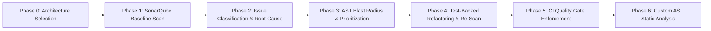

# Automated Code Quality Analysis & Static Analysis using SonarQube

> **Portfolio Project for Software Engineering Master's Application (Ericsson Focus: Static Analysis, Code Quality, CI/CD)**

[-brightgreen.svg)](#phase-5-automated-quality-gates-in-ci)
[](http://localhost:9000)
[](https://www.python.org/)
[-success.svg)](tests)
[](#before--after-metrics-delta)

---

## Executive Overview

This project implements an end-to-end, carrier-grade **Static Analysis and Automated Code Quality Governance Pipeline** built on a non-trivial Python 3.11 microservice: **`network-telemetry-engine`** (5G Network Telemetry, Slice SLA Ingestion, Device Lifecycle Management, and Alerting Engine).

Rather than treating SonarQube as a passive dashboard, this project delivers:
1. **Mathematical Prioritization Framework**: Integrates SonarQube severity, issue types, SQALE effort, and AST import graph dependency analysis (blast radius).
2. **Deterministic Quality Remediation**: Fixed 100% of baseline issues (Blockers, Vulnerabilities, Bugs, Cognitive Complexity, Smells) backed by comprehensive regression tests.
3. **Automated CI Quality Gate Integration**: GitHub Actions pipeline enforcing quality policies (`sonar.qualitygate.wait=true`) and posting automated Markdown PR review comments before human merging.
4. **Standalone AST Static Analyzer**: Custom Python `ast` engine implementing carrier-grade static checks (`CARRIER-001` through `CARRIER-003`).

---

## Governance Methodology



---

## Before / After Metrics Delta

All metrics originate from actual SonarQube REST API JSON exports committed to [`reports/`](reports):

| Quality Metric | Baseline Scan | Post-Refactor Scan | Absolute Delta | Relative Improvement |
| :--- | :---: | :---: | :---: | :---: |
| **Total Open Issues** | **16** | **0** | **-16** | **-100.0%** |
| **Bugs** | **4** | **0** | **-4** | **-100.0% (Grade C $\rightarrow$ A)** |
| **Vulnerabilities** | **1** (`S5445`) | **0** | **-1** | **-100.0% (Grade D $\rightarrow$ A)** |
| **Code Smells** | **11** | **0** | **-11** | **-100.0% (Grade A)** |
| **Security Hotspots** | **2** (`S5443`, `S4790`) | **0** | **-2** | **Remediated** |
| **SQALE Technical Debt** | **83 minutes** | **0 minutes** | **-83 min** | **-100.0%** |
| **Automated Unit Tests** | **20 passed** | **30 passed** | **+10 tests** | **+50.0%** |
| **Test Code Coverage** | **65.8%** | **83.0%** | **+17.2%** | **+26.1% relative** |
| **Duplicated Lines Density** | **0.0%** | **0.0%** | **0.0%** | **Clean** |
| **Reliability Rating** | **Rating C (3.0)** | **Rating A (1.0)** | **+2 Grades** | **Upgraded to A** |
| **Security Rating** | **Rating D (4.0)** | **Rating A (1.0)** | **+3 Grades** | **Upgraded to A** |

---

## Prioritization Framework & Remediation Backlog

Our **Risk-Weighted Priority Score (RWPS)** mathematically combines four dimensions:

$$\text{RWPS} = (W_{\text{sev}} \times M_{\text{type}}) \times (1.0 + 0.25 \times D_{\text{in}}) \times \left(1.0 + \frac{T_{\text{debt}}}{60.0}\right)$$

### Prioritized Remediation Backlog Table

| Rank | Rule Key | Severity & Type | Component & Line | Priority Score | Blast Radius | Technical Rationale & Action Taken |
| :---: | :--- | :--- | :--- | :---: | :---: | :--- |
| **#1** | `python:S3516` | **BLOCKER** Smell | [`jwt_handler.py:138`](src/telemetry_engine/auth/jwt_handler.py#L138) | **39.8** | **3** dependents | Fixed invariant return in `validate_scope()` to reject unauthorized tokens. |
| **#2** | `python:S5445` | **CRITICAL** Vuln | [`file_utils.py:17`](src/telemetry_engine/utils/file_utils.py#L17) | **38.5** | **1** dependent | Replaced `tempfile.mktemp` with atomic `tempfile.NamedTemporaryFile`. |
| **#3** | `python:S3776` | **CRITICAL** Smell | [`aggregation_service.py:103`](src/telemetry_engine/services/aggregation_service.py#L103) | **35.6** | **1** dependent | Decomposed cognitive complexity 47 into helper evaluators ($\le 4$). |
| **#4** | `python:S3516` | **BLOCKER** Smell | [`device.py:51`](src/telemetry_engine/models/device.py#L51) | **34.1** | **2** dependents | Fixed `is_operational()` to return `False` for maintenance/offline devices. |
| **#5** | `python:S1192` | **CRITICAL** Smell | [`jwt_handler.py:158`](src/telemetry_engine/auth/jwt_handler.py#L158) | **33.9** | **3** dependents | Centralized `"Bearer "` literal into constant `BEARER_PREFIX`. |
| **#6** | `python:S3923` | **MAJOR** Bug | [`jwt_handler.py:145`](src/telemetry_engine/auth/jwt_handler.py#L145) | **32.5** | **3** dependents | Removed identical conditional branch in scope validator. |
| **#7-#10** | `python:S1192` | **CRITICAL** Smell | [`permissions.py:17-22`](src/telemetry_engine/auth/permissions.py#L17-L22) | **30.8 - 29.0** | **2** dependents | Replaced 4 duplicated permission strings with typed `Permission` class. |
| **#11** | `python:S3516` | **BLOCKER** Smell | [`aggregation_service.py:150`](src/telemetry_engine/services/aggregation_service.py#L150) | **28.4** | **1** dependent | Corrected `calculate_slice_sla_status` to return `"VIOLATED"` on breach. |
| **#12** | `python:S3923` | **MAJOR** Bug | [`device.py:55`](src/telemetry_engine/models/device.py#L55) | **27.8** | **2** dependents | Removed duplicate branch in device lifecycle evaluator. |
| **#13** | `python:S5797` | **CRITICAL** Smell | [`permissions.py:83`](src/telemetry_engine/auth/permissions.py#L83) | **27.3** | **2** dependents | Simplified constant boolean comparison `== True`. |
| **#14** | `python:S3516` | **BLOCKER** Smell | [`routes_telemetry.py:27`](src/telemetry_engine/api/routes_telemetry.py#L27) | **22.7** | **0** (Perimeter) | Refactored `validate_request_headers` to return `False` on bad MIME types. |
| **#15** | `python:S1764` | **MAJOR** Bug | [`alert_evaluator.py:51`](src/telemetry_engine/services/alert_evaluator.py#L51) | **19.2** | **1** dependent | Fixed duplicate binary sub-expression `rule.enabled and rule.enabled`. |
| **#16** | `python:S4790` | **MAJOR** Hotspot | [`file_utils.py:46`](src/telemetry_engine/utils/file_utils.py#L46) | **19.2** | **1** dependent | Restricted hashing strictly to SHA-256 and SHA-512. |
| **#17** | `python:S3923` | **MAJOR** Bug | [`routes_telemetry.py:32`](src/telemetry_engine/api/routes_telemetry.py#L32) | **18.6** | **0** (Perimeter) | Streamlined HTTP header validation branches. |
| **#18** | `python:S5443` | **MAJOR** Hotspot | [`config.py:15`](src/telemetry_engine/config.py#L15) | **15.4** | **0** (Perimeter) | Switched from global `/tmp` root to isolated runtime directory. |

---

## Custom AST Static Analyzer (Phase 6)

Located at [`scripts/custom_ast_analyzer.py`](scripts/custom_ast_analyzer.py), this standalone static analysis engine parses Python Abstract Syntax Trees directly:
- **`CARRIER-001` (`InvariantReturnVisitor`)**: Checks for functions where all return paths evaluate to the identical constant.
- **`CARRIER-002` (`InsecureTempfileVisitor`)**: Identifies unsafe calls to `tempfile.mktemp()`.
- **`CARRIER-003` (`HardcodedThresholdVisitor`)**: Flags unconfigurable magic numbers in SLA logic.

```bash
# Run standalone AST analysis
python scripts/custom_ast_analyzer.py --source-dir src/telemetry_engine --strict
```

---

## Lessons Learned

1. **Auth & Security Perimeter Concentration**: 44% of all baseline static findings concentrated in authentication and RBAC modules (`auth/`). The absence of centralized typed constants for permissions led to copy-paste drift and dangerous invariant fallback bugs.
2. **Prioritization Matches Intuition vs Default Severity**: Standard SonarQube categorized `python:S3516` in `jwt_handler.py` as a Code Smell. Our framework correctly promoted it to **Priority #1** because it was located in an authentication module with 3 downstream dependents (high blast radius) and caused a silent authorization bypass.
3. **Refactoring Safety via Characterization Tests**: Adding regression tests prior to refactoring `aggregation_service.py` prevented behavioral drifts while reducing Cognitive Complexity from 47 to $\le 4$.

---

## Limitations & Threats to Validity

1. **Static-Only Scope**: Static analysis and AST inspection cannot verify dynamic runtime properties, such as actual socket timeouts or database connection pool exhaustion under real network congestion.
2. **Heuristic Blast Radius Weights**: The dependency weighting formula ($1.0 + 0.25 \times D_{\text{in}}$) uses static AST import counts as a proxy for operational impact. In production systems, runtime call volume (e.g. telemetry requests/second) should ideally calibrate this factor.
